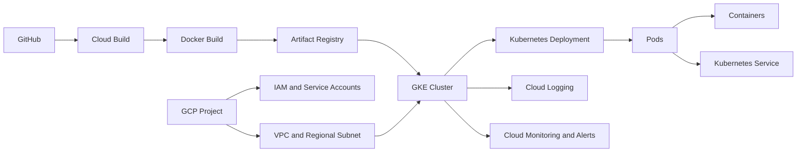

# GCP Kubernetes CI/CD Lab

This portfolio project is a hands-on Google Cloud infrastructure and DevOps lab that follows a small Flask application from source code to a containerized workload running on Google Kubernetes Engine (GKE).

The application is intentionally simple so the project can focus on infrastructure, operations, automation, observability, and troubleshooting. The completed work demonstrates the full path from GitHub through Cloud Build and Artifact Registry to a production-style Kubernetes workload.

## Learning objectives

- Build familiarity with GCP projects, resource organization, IAM, and service accounts.
- Configure VPC networking, subnets, Artifact Registry, and GKE.
- Package a small Python application as a Docker image.
- Deploy and operate workloads with Kubernetes Deployments, Pods, Nodes, and Services.
- Practice scaling, self-healing, rolling updates, and application troubleshooting.
- Build a Cloud Build CI/CD workflow.
- Use Cloud Logging, Cloud Monitoring, and alerts to investigate workload behavior.

## Planned architecture



The network model separates infrastructure addresses from Kubernetes-managed ranges: GKE nodes use the subnet primary range (`10.10.1.0/24`), Pods use the `gke-pods` secondary range (`10.20.0.0/20`), and Service ClusterIPs use the `gke-services` secondary range (`10.30.0.0/24`).

## Technologies

Google Cloud Platform, IAM, service accounts, VPC, Docker, Artifact Registry, Google Kubernetes Engine, Kubernetes, Cloud Build, Cloud Logging, Cloud Monitoring, Python, and GitHub.

## Completed project phases

1. GCP foundation
2. Simple Python application and Docker
3. Artifact Registry
4. GKE cluster and node environment
5. Kubernetes application deployment
6. Kubernetes Service and networking
7. Scaling and self-healing
8. Rolling update from v1 to v2
9. Cloud Build CI/CD
10. Cloud Logging and Cloud Monitoring
11. Troubleshooting scenarios
12. Final architecture, documentation, and portfolio cleanup

## Current progress

The core lab is complete. It includes the GCP foundation, Flask application, Docker image, Artifact Registry, Standard GKE cluster, Kubernetes Deployment and Service, scaling and self-healing tests, rolling updates, Cloud Build CI/CD, health probes, resource management, HPA, logging, monitoring, alerting, and layered troubleshooting incidents.

## Repository structure

```text
app/                         Simple Python application and container files
kubernetes/                  Kubernetes manifests and notes
cicd/                        Cloud Build pipeline files and documentation
docs/architecture/           Architecture documentation
docs/setup-guides/           Phase setup guides
docs/troubleshooting/        Troubleshooting documentation
docs/notes/                  Working notes and reference material
screenshots/                 Evidence organized by project phase
```

## Evidence and documentation

The repository is organized so the screenshots tell the same story as the configuration and runbooks:

- [Architecture documentation](docs/architecture/README.md) explains the resource and traffic model.
- [Setup guides](docs/setup-guides/README.md) describe the build sequence and validation approach.
- [Troubleshooting documentation](docs/troubleshooting/README.md) records the investigation method and incident outcomes.
- [Operational notes](docs/notes/README.md) capture the Kubernetes, IAM, CI/CD, and observability mental models developed during the lab.
- [Screenshots](screenshots/README.md) provide phase-based evidence from the GCP Console, terminal, Kubernetes, Cloud Build, and Monitoring.

## Security and secrets

Credentials, service-account keys, API keys, access tokens, passwords, local environment files, and sensitive Terraform state must never be committed. The lab uses a dedicated deployment service account and keeps application image identity separate from human credentials. Future integrations should use environment variables, GitHub Secrets, Google Secret Manager, Workload Identity, or another appropriate secure mechanism.
