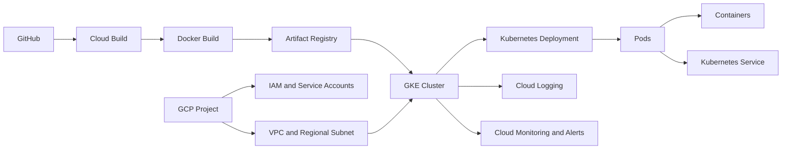

# GCP Kubernetes CI/CD Lab

This portfolio project is a hands-on Google Cloud infrastructure and DevOps lab focused on the path from application source code to a containerized workload running on Google Kubernetes Engine (GKE).

The application will remain intentionally simple. The primary focus is GCP foundations, IAM, networking, containers, Kubernetes operations, CI/CD, observability, and troubleshooting.

## Learning objectives

- Build familiarity with GCP projects, resource organization, IAM, and service accounts.
- Configure VPC networking, subnets, Artifact Registry, and GKE.
- Package a small Python application as a Docker image.
- Deploy and operate workloads with Kubernetes Deployments, Pods, Nodes, and Services.
- Practice scaling, self-healing, rolling updates, and application troubleshooting.
- Build a Cloud Build CI/CD workflow.
- Use Cloud Logging, Cloud Monitoring, and alerts to investigate workload behavior.

## Planned architecture



## Technologies

Google Cloud Platform, IAM, service accounts, VPC, Docker, Artifact Registry, Google Kubernetes Engine, Kubernetes, Cloud Build, Cloud Logging, Cloud Monitoring, Python, and GitHub.

## Project phases

1. GCP foundation
2. Simple Python application and Docker
3. Artifact Registry
4. GKE cluster and node environment
5. Kubernetes application deployment
6. Kubernetes Service and networking
7. Scaling and self-healing
8. Rolling update from v1 to v2
9. Cloud Build CI/CD
10. Cloud Logging and Cloud Monitoring
11. Troubleshooting scenarios
12. Final architecture, documentation, and portfolio cleanup

## Current progress

The repository scaffold has been initialized. Each phase will be documented with the configuration, validation evidence, and troubleshooting notes created during the lab.

## Repository structure

```text
app/                         Simple Python application and container files
kubernetes/                  Kubernetes manifests and notes
cicd/                        Cloud Build pipeline files and documentation
docs/architecture/           Architecture documentation
docs/setup-guides/           Phase setup guides
docs/troubleshooting/        Troubleshooting documentation
docs/notes/                  Working notes and reference material
screenshots/                 Evidence organized by project phase
```

## Screenshots and documentation

Screenshots will be added as each phase is completed. Each useful screenshot will include a concise caption describing what it demonstrates, with sensitive values removed or excluded.

## Security and secrets

Credentials, service-account keys, API keys, access tokens, passwords, local environment files, and sensitive Terraform state must never be committed. Future integrations will use environment variables, GitHub Secrets, Google Secret Manager, Workload Identity, or another appropriate secure mechanism.
